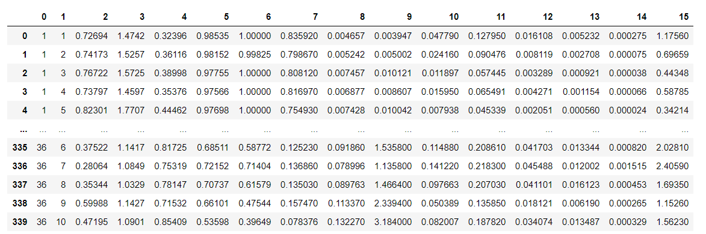
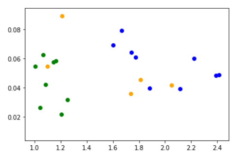
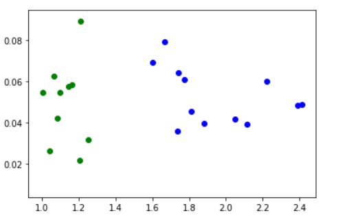
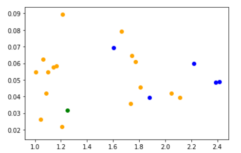
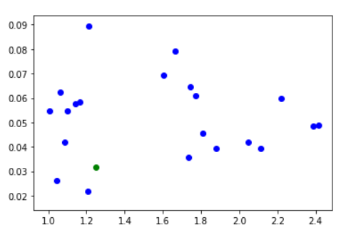

# NN-and-KNN-classifiers

Implementacja algorytmu klasyfikacji liści przy wykorzystaniu klasyfikatorów NN (Najbliższych sąsiadów) oraz K-NN (K-najbliższych sąsiadów). Program dokonuje klasyfikacji typów liści na podstawie dwóch wybranych cech. Została pokazana także tablica pomyłek (confusion matrix). W projekcie został użyty język Python oraz biblioteki: sklearn, matplotlib, pandas. 

Poniższy obrazek reprezentuje zbiór danych (różnych typów liści) które następnie zostały podzielone na podzbiór testowy oraz podzbiór treningowy.

  

Wykres przedstawia dwa gatunki liści (kolor zielony oraz niebieski) a także próbki mające być poddane klasyfikacji za pomocą klasyfikatora najbliższych sąsiadów.

Wynik działania klasyfikatora NN. Żółte próbki zostały przyporządkowane odpowiednim gatunkom liści. 

 

Próbki przed klasyfikacją K-NN. Klasyfikator ten w odróżnieniu od poprzedniego dokonuje przyporządkowania na podstawie określonych kilku najbliższych sąsiadów a nie tylko jednej najbliższej próbki jak w przypadku NN.  

 

Próbki po klasyfikacją K-NN.

 

